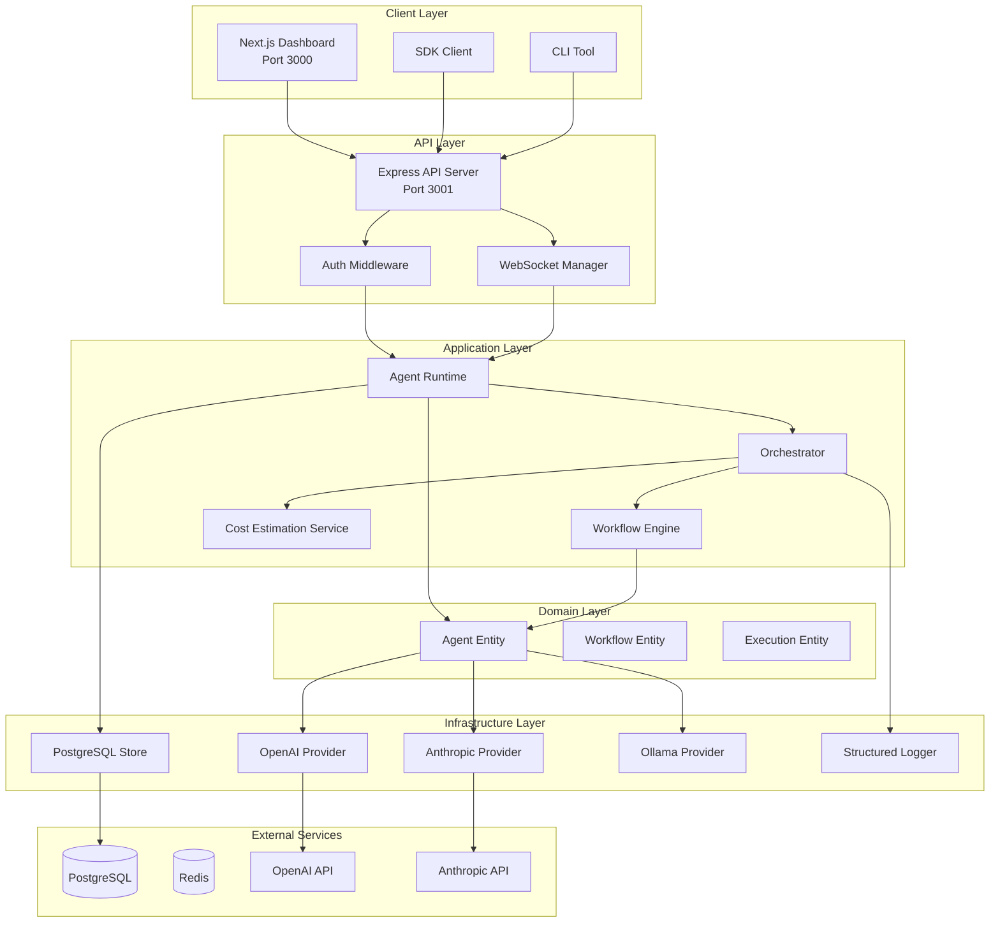
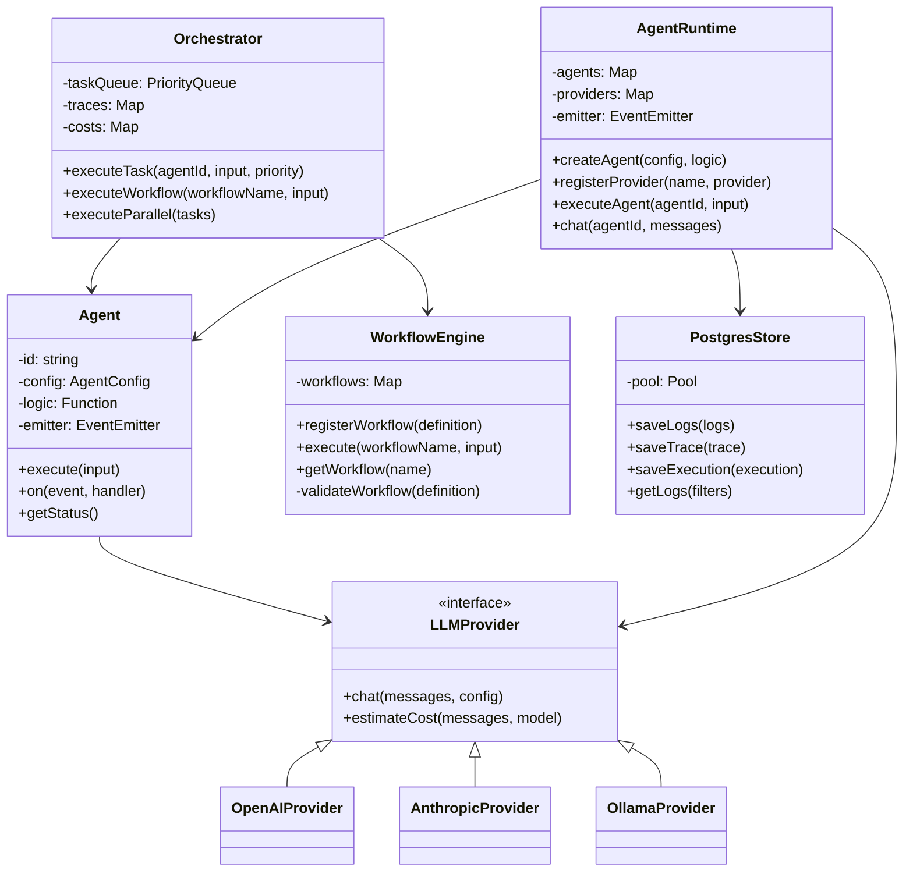
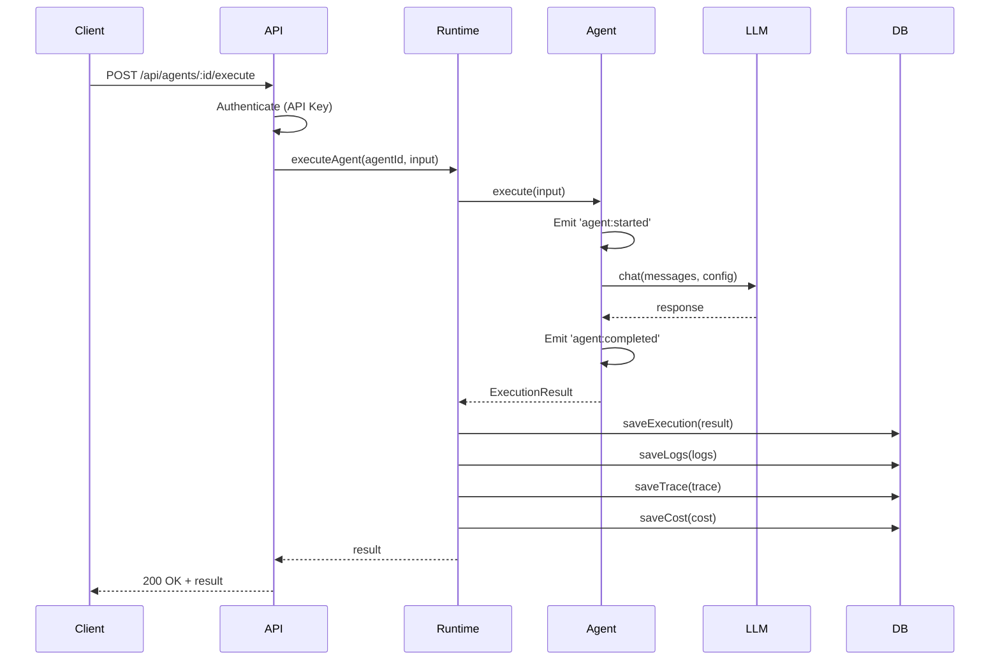
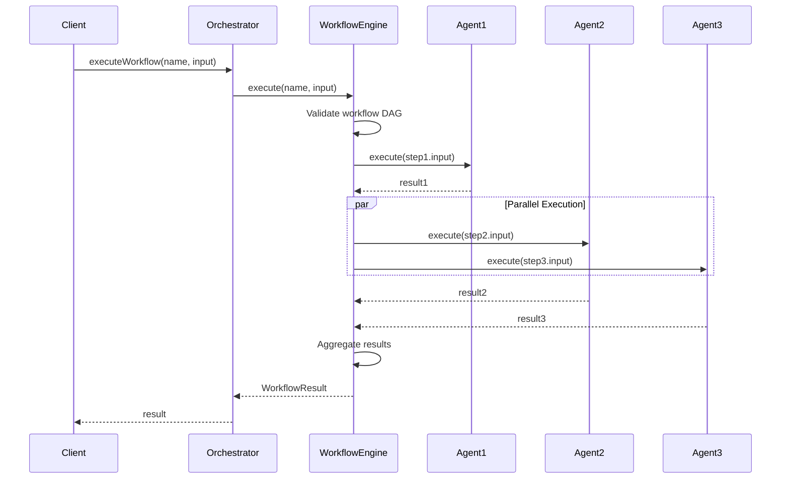

# Architecture - Aethermind AgentOS

> Technical architecture documentation for Aethermind AgentOS v0.1.0

## Table of Contents

- [Overview](#overview)
- [System Architecture](#system-architecture)
- [Component Diagram](#component-diagram)
- [Data Flow](#data-flow)
- [Layer Architecture](#layer-architecture)
- [Key Components](#key-components)
- [Design Patterns](#design-patterns)
- [Technology Stack](#technology-stack)
- [Scalability Considerations](#scalability-considerations)

---

## Overview

Aethermind AgentOS is built as a **monorepo** using pnpm workspaces and Turborepo. The architecture follows a modular design with clear separation between:

- **Presentation Layer** - API endpoints and WebSocket connections
- **Application Layer** - Business logic and orchestration
- **Domain Layer** - Core entities and interfaces
- **Infrastructure Layer** - External integrations (DB, LLM providers, caching)

### Architecture Principles

1. **Separation of Concerns** - Each layer has distinct responsibilities
2. **Dependency Inversion** - High-level modules don't depend on low-level details
3. **Event-Driven** - Components communicate via events (EventEmitter)
4. **Stateless API** - API server is stateless, state persisted in PostgreSQL
5. **Type Safety** - Full TypeScript with strict mode enabled

---

## System Architecture



---

## Component Diagram

### Core Components



---

## Data Flow

### Agent Execution Flow



### Workflow Execution Flow



---

## Layer Architecture

### 1. Presentation Layer

**Location**: `apps/api/src/routes/`, `apps/api/src/websocket/`

**Responsibilities**:

- HTTP request handling
- Input validation (Zod schemas)
- Authentication and authorization
- WebSocket connection management
- Response formatting

**Key Files**:

- `routes/agents.ts` - Agent CRUD and execution endpoints
- `routes/workflows.ts` - Workflow management endpoints
- `routes/executions.ts` - Execution history endpoints
- `routes/logs.ts` - Log retrieval endpoints
- `routes/traces.ts` - Trace visualization endpoints
- `routes/costs.ts` - Cost tracking endpoints
- `websocket/WebSocketManager.ts` - Real-time updates

### 2. Application Layer

**Location**: `packages/core/src/orchestrator/`, `packages/core/src/agent/`

**Responsibilities**:

- Business logic orchestration
- Workflow execution
- Task queue management
- Cost estimation
- Trace generation

**Key Files**:

- `orchestrator/Orchestrator.ts` - Multi-agent coordination
- `workflow/WorkflowEngine.ts` - Workflow DAG execution
- `agent/AgentRuntime.ts` - Agent lifecycle management
- `services/CostEstimationService.ts` - Cost calculation

### 3. Domain Layer

**Location**: `packages/core/src/agent/`, `packages/core/src/types/`

**Responsibilities**:

- Core business entities
- Domain logic
- Type definitions
- Validation schemas

**Key Files**:

- `agent/Agent.ts` - Agent entity
- `types/index.ts` - Type definitions and schemas
- `state/StateManager.ts` - State management
- `logger/StructuredLogger.ts` - Logging abstraction

### 4. Infrastructure Layer

**Location**: `apps/api/src/services/`, `packages/core/src/providers/`

**Responsibilities**:

- Database access
- External API integration
- Caching
- File system operations

**Key Files**:

- `services/PostgresStore.ts` - PostgreSQL data access
- `services/InMemoryStore.ts` - In-memory fallback
- `providers/OpenAIProvider.ts` - OpenAI integration
- `providers/AnthropicProvider.ts` - Anthropic integration
- `providers/OllamaProvider.ts` - Ollama integration

---

## Key Components

### AgentRuntime

**Purpose**: Central runtime for managing agents and LLM providers

**Features**:

- Agent registration and lifecycle management
- LLM provider registration
- Concurrent execution control
- Event emission for monitoring

**Configuration**:

```typescript
const runtime = new AgentRuntime({
  maxConcurrentExecutions: 10,
  defaultTimeout: 30000,
  defaultRetries: 3,
});
```

### Orchestrator

**Purpose**: Coordinate multiple agents in complex workflows

**Features**:

- Priority-based task queue
- Workflow DAG execution
- Trace tree generation
- Cost tracking
- Parallel execution support

**Workflow Example**:

```typescript
const workflow = {
  name: "research-workflow",
  steps: [
    { id: "research", agent: "researcher" },
    { id: "analyze", agent: "analyst", dependsOn: ["research"] },
    { id: "write", agent: "writer", dependsOn: ["analyze"] },
  ],
};
```

### Agent

**Purpose**: Individual AI agent with specific capabilities

**Features**:

- Retry logic with exponential backoff
- Timeout handling
- Event emission (started, completed, failed)
- State management
- Structured logging

**Lifecycle Events**:

- `agent:started` - Execution begins
- `agent:status` - Status updates
- `agent:completed` - Successful completion
- `agent:failed` - Execution failed

### LLM Providers

**Purpose**: Abstract LLM API integrations

**Interface**:

```typescript
interface LLMProvider {
  chat(messages: ChatMessage[], config: LLMConfig): Promise<ChatResponse>;
  estimateCost(messages: ChatMessage[], model: string): Promise<number>;
}
```

**Implementations**:

- **OpenAIProvider** - GPT-3.5, GPT-4, GPT-4-turbo
- **AnthropicProvider** - Claude 3 (Opus, Sonnet, Haiku)
- **OllamaProvider** - Local models (Llama 2, Mistral, etc.)

### PostgresStore

**Purpose**: Persistent storage for all system data

**Schema**:

- `logs` - Structured logs with levels and metadata
- `traces` - Execution traces (DAG structure)
- `executions` - Agent execution records
- `costs` - LLM API cost tracking
- `workflows` - Workflow definitions
- `agents` - Agent configurations

**Indexes**:

- `logs(executionId, timestamp, level)`
- `traces(executionId)`
- `executions(agentId, status, createdAt)`

---

## Design Patterns

### 1. Event-Driven Architecture

**Pattern**: Observer pattern using EventEmitter3

**Usage**:

```typescript
agent.on("agent:completed", (result) => {
  console.log("Agent completed:", result);
});
```

**Benefits**:

- Loose coupling between components
- Easy to add monitoring and logging
- Supports real-time updates via WebSocket

### 2. Strategy Pattern

**Pattern**: LLM Provider abstraction

**Usage**:

```typescript
runtime.registerProvider("openai", new OpenAIProvider(apiKey));
runtime.registerProvider("anthropic", new AnthropicProvider(apiKey));
```

**Benefits**:

- Easy to add new LLM providers
- Swap providers without changing agent code
- Testable with mock providers

### 3. Repository Pattern

**Pattern**: Data access abstraction

**Usage**:

```typescript
const store = new PostgresStore(config);
await store.saveLogs(logs);
const logs = await store.getLogs({ level: "error" });
```

**Benefits**:

- Decouples business logic from data access
- Easy to switch storage backends
- Testable with in-memory store

### 4. Factory Pattern

**Pattern**: Agent and workflow creation

**Usage**:

```typescript
const agent = createAgent({
  name: "researcher",
  model: "gpt-4",
  logic: async (ctx) => {
    /* ... */
  },
});
```

**Benefits**:

- Consistent object creation
- Encapsulates complex initialization
- Type-safe configuration

---

## Technology Stack

### Backend

| Technology | Version | Purpose             |
| ---------- | ------- | ------------------- |
| Node.js    | 20+     | Runtime environment |
| TypeScript | 5.4     | Type safety         |
| Express    | 4.19    | HTTP server         |
| ws         | 8.16    | WebSocket server    |
| PostgreSQL | 16      | Primary database    |
| Prisma     | 6.19.0  | ORM and migrations  |
| pg         | 8.12    | PostgreSQL client   |
| Zod        | 3.23    | Schema validation   |
| bcryptjs   | 2.4     | Password hashing    |
| helmet     | 7.1     | Security headers    |
| cors       | 2.8     | CORS handling       |

### Frontend

| Technology   | Version | Purpose               |
| ------------ | ------- | --------------------- |
| Next.js      | 14.2    | React framework       |
| React        | 18.2    | UI library            |
| Tailwind CSS | 3.4     | Styling               |
| Radix UI     | -       | Accessible components |
| Recharts     | 2.12    | Data visualization    |
| Lucide React | -       | Icons                 |

### Development

| Technology | Version | Purpose               |
| ---------- | ------- | --------------------- |
| pnpm       | 9.0     | Package manager       |
| Turborepo  | 2.6     | Monorepo build system |
| Jest       | 30.2    | Testing framework     |
| tsx        | 4.7     | TypeScript execution  |
| Docker     | -       | Containerization      |

---

## Scalability Considerations

### Current Limitations (v0.1.0)

1. **Single-region deployment** - No multi-region support
2. **In-memory task queue** - Lost on restart
3. **No horizontal scaling** - Single API server instance
4. **Polling-based queue** - CPU inefficient at scale

### Planned Improvements

#### Phase 1: Immediate (v0.2.0)

- **Redis-backed task queue** - Persistent queue
- **Event-based queue processing** - Replace polling
- **Connection pooling** - Optimize database connections
- **Query pagination** - Limit result set sizes

#### Phase 2: Short-term (v0.3.0)

- **Horizontal scaling** - Multiple API server instances
- **Load balancing** - Distribute requests
- **Caching layer** - Redis for frequently accessed data
- **Circuit breakers** - Prevent cascade failures

#### Phase 3: Long-term (v0.4.0+)

- **Kubernetes deployment** - Container orchestration
- **Multi-region** - Geographic distribution
- **Message queue** - RabbitMQ/Kafka for async processing
- **Microservices** - Split monolith into services

### Performance Targets

| Metric               | Current | Target (v0.3.0) |
| -------------------- | ------- | --------------- |
| API Latency (P95)    | ~200ms  | <100ms          |
| Concurrent Users     | ~100    | 1000+           |
| Workflow Throughput  | ~10/min | 100/min         |
| Database Connections | 20      | 100             |
| Uptime               | 99%     | 99.9%           |

---

## Security Architecture

### Authentication

- **API Key** - bcrypt hashed, stored in environment
- **WebSocket** - API key via header or query param
- **Rate Limiting** - 100 requests per 15 minutes

### Data Protection

- **Encryption at rest** - PostgreSQL encryption
- **Encryption in transit** - HTTPS/WSS
- **Credential sanitization** - Logs scrubbed of sensitive data
- **SQL injection protection** - Prepared statements

### Future Enhancements

- **JWT tokens** - User authentication
- **RBAC** - Role-based access control
- **OAuth 2.0** - Third-party authentication
- **Audit logging** - Security event tracking

---

## Monitoring and Observability

### Current Implementation

- **Structured Logging** - JSON logs with levels and metadata
- **Execution Traces** - DAG visualization of workflow execution
- **Cost Tracking** - Per-execution LLM cost tracking
- **WebSocket Events** - Real-time updates to dashboard

### Planned Additions

- **Prometheus Metrics** - `/metrics` endpoint
- **Grafana Dashboards** - Pre-built monitoring dashboards
- **OpenTelemetry** - Distributed tracing
- **Alerting** - Slack/Discord webhooks for errors

---

## Deployment Architecture

### Development

```
Developer Machine
├── API Server (tsx watch)
├── Dashboard (next dev)
└── Docker Compose
    ├── PostgreSQL
    └── Redis
```

### Production (Recommended)

```
Cloud Provider (AWS/GCP/Azure)
├── Load Balancer
├── API Servers (2+ instances)
│   └── Docker containers
├── Dashboard (Vercel/Netlify)
├── PostgreSQL (Managed service)
└── Redis (Managed service)
```

---

**Last Updated**: 2025-11-28  
**Version**: 0.1.0  
**Maintainer**: Aethermind Team
